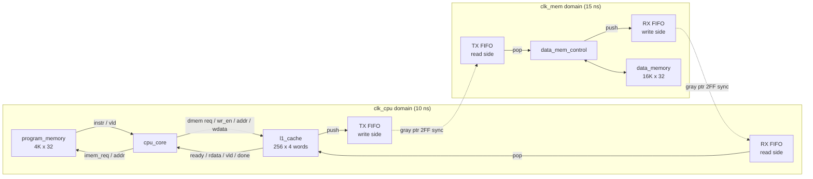
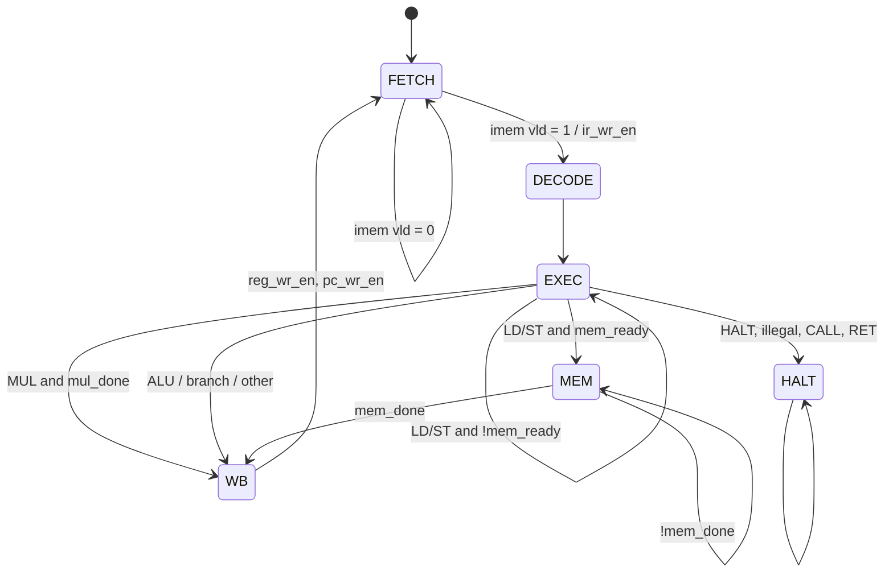

# CPU_LITE Design Specification

| Item | Value |
|---|---|
| Design | CPU_LITE |
| Top module | `cpu_top` |
| HDL | Verilog-2001 |
| Architecture | 32-bit, multicycle (non-pipelined), load/store |
| Clock domains | `clk_cpu` (100 MHz), `clk_mem` (~66.7 MHz), asynchronous |
| Reset | Asynchronous, active-low, one per domain |

---

## 1. Overview

CPU_LITE is a small 32-bit multicycle processor with a separate instruction memory and a data-memory subsystem that runs in a slower, asynchronous clock domain.

Main features:

- 32-bit datapath, 16 general-purpose registers (R0-R15, R0 is a normal register).
- Fixed 32-bit instruction format, 8-bit opcode, 40 opcodes defined (38 implemented).
- Multicycle control FSM: FETCH, DECODE, EXEC, MEM, WB, HALT.
- ALU with add/sub/logic/shift/rotate/compare and a 2-cycle 32x32 multiplier.
- 4-bit status register PSR = {V, C, N, Z}, per-instruction flag write mask.
- 4K x 32 program memory (synchronous read, loaded by the testbench).
- Data path: L1 data cache (clk_cpu) -> CDC bridge (two async FIFOs) -> memory controller (clk_mem) -> 16K x 32 data memory.
- L1 cache: direct-mapped, 256 lines x 4 words, write-through, no-write-allocate.

---

## 2. Top-Level Block Diagram



### 2.1 Module hierarchy

```
cpu_top
├── u_cpu_core          cpu_core
│   ├── u_decoder       instruction_decoder
│   ├── u_regfile       reg_file
│   ├── u_imm_gen       imm_gen
│   ├── u_addr_gen      addr_gen
│   ├── u_alu           alu
│   ├── u_brnach_unit   branch_unit
│   ├── u_pc_unit       pc_unit
│   └── u_ctrl_fsm      control_fsm
├── u_program_memory    program_memory
└── u_mem_subsys        mem_subsys_top
    ├── u1_l1_cache     l1_cache
    ├── u_cdc_bridge    cdc_bridge
    │   ├── u_tx_fifo   async_fifo   (clk_cpu -> clk_mem)
    │   └── u_rx_fifo   async_fifo   (clk_mem -> clk_cpu)
    ├── u_data_mem_control  data_mem_control
    └── u_data_mem      data_memory
```

### 2.2 Source files

| File | Module | Domain |
|---|---|---|
| `cpu_top.v` | `cpu_top` | both |
| `cpu_core.v` | `cpu_core` | clk_cpu |
| `control_fsm.v` | `control_fsm` | clk_cpu |
| `instruction_decoder.v` | `instruction_decoder` | comb |
| `reg_file.v` | `reg_file` | clk_cpu |
| `alu.v` | `alu` | clk_cpu |
| `imm_gen.v` | `imm_gen` | comb |
| `addr_gen.v` | `addr_gen` | comb |
| `branch_unit.v` | `branch_unit` | comb |
| `pc_unit.v` | `pc_unit` | clk_cpu |
| `program_memory.v` | `program_memory` | clk_cpu |
| `mem_subsys_top.v` | `mem_subsys_top` | both |
| `l1_cache.v` | `l1_cache` | clk_cpu |
| `cdc_bridge.v` | `cdc_bridge` | both |
| `async_fifo.v` | `async_fifo` | both |
| `data_mem_control.v` | `data_mem_control` | clk_mem |
| `data_memory.v` | `data_memory` | clk_mem |

---

## 3. Top-Level Interface (`cpu_top`)

| Port | Dir | Width | Domain | Description |
|---|---|---|---|---|
| `clk_cpu` | in | 1 | - | Core clock, 10 ns |
| `rst_cpu_n` | in | 1 | clk_cpu | Async active-low reset for the core, program memory, cache, FIFO cpu-side |
| `clk_mem` | in | 1 | - | Memory clock, 15 ns |
| `rst_mem_n` | in | 1 | clk_mem | Async active-low reset for memory controller, data memory, FIFO mem-side |
| `halted_out` | out | 1 | clk_cpu | 1 while the control FSM is in HALT |
| `illegal_out` | out | 1 | clk_cpu | 1 while the instruction register holds an undefined opcode |

### 3.1 Parameters

| Parameter | Default | Where | Meaning |
|---|---|---|---|
| `PC_WIDTH` | 12 | cpu_core, program_memory | Program address width (4096 words) |
| `DMEM_ADDR_WIDTH` / `ADDR_WIDTH` | 14 | cpu_core, mem_subsys | Data word address width (16384 words) |
| `DATA_WIDTH` | 32 | mem_subsys | Data width |
| `NUM_LINES` | 256 | l1_cache | Cache lines |
| `INDEX_WIDTH` | 8 | l1_cache | log2(NUM_LINES) |
| `WORDS_PER_LINE` | 4 | l1_cache | Words per line |
| `TX_FIFO_DEPTH_LOG2` | 3 | cdc_bridge | TX FIFO depth = 8 |
| `RX_FIFO_DEPTH_LOG2` | 3 | cdc_bridge | RX FIFO depth = 8 |

---

## 4. Programmer's Model

### 4.1 Registers

| Register | Width | Description |
|---|---|---|
| R0-R15 | 32 | General purpose. Two combinational read ports, one synchronous write port. All cleared on reset. |
| PC | 12 | Word address into program memory. Reset to 0. |
| PSR | 4 | Status flags, cleared on reset. |

PSR bit map:

| Bit | Flag | Meaning |
|---|---|---|
| 0 | Z | Result is zero |
| 1 | N | Result bit 31 |
| 2 | C | Carry out of bit 31 (for SUB/CMP: 1 = no borrow, A >= B unsigned) |
| 3 | V | Signed overflow |

### 4.2 Instruction format

All instructions are 32 bits:

```
 31        24 23    20 19    16 15    12 11                0
+------------+--------+--------+--------+-------------------+
|   opcode   |   rd   |  rs1   |  rs2   |      imm[11:0]    |
+------------+--------+--------+--------+-------------------+
      8          4        4        4             12
```

Immediate formats produced by `imm_gen`:

| Mode | Used by | Value |
|---|---|---|
| Zero-extend | LOAD_IMM, ANDI, ORI, XORI | `{20'b0, imm}` |
| Sign-extend | ADDI, SUBI | `{{20{imm[11]}}, imm}` |
| LUI | LUI | `{imm, 20'b0}` |

Branch/jump targets are **absolute**: `target = imm[11:0]`.
Direct load/store addresses are `{2'b00, imm[11:0]}`, so direct addressing reaches words 0-4095; use indirect forms for the full 16K range.

### 4.3 Instruction set

| Opcode | Mnemonic | Operation | Flags (Z N C V) |
|---|---|---|---|
| 0x00 | NOP | no operation | - |
| 0x01 | LOAD | rd = DMEM[imm] | - |
| 0x02 | LOAD_IND | rd = DMEM[rs1] | - |
| 0x03 | LOAD_IMM | rd = zext(imm) | - |
| 0x04 | STORE | DMEM[imm] = rd | - |
| 0x05 | STORE_IND | DMEM[rs2] = rd | - |
| 0x06 | ADD | rd = rs1 + rs2 | Z N C V |
| 0x07 | SUB | rd = rs1 - rs2 | Z N |
| 0x08 | MUL | rd = (rs1 * rs2)[31:0] | Z N |
| 0x09 | AND | rd = rs1 & rs2 | Z N |
| 0x0A | OR | rd = rs1 \| rs2 | Z N |
| 0x0B | NOT | rd = ~rs1 | Z N |
| 0x0C | CMP | rs1 - rs2, result discarded | Z N C V |
| 0x0D | EQ | rd = (rs1 == rs2) | Z (see 11) |
| 0x0E | JMP | PC = imm | - |
| 0x0F | JMP_IF | if (rs1 != 0) PC = imm | - |
| 0x10 | XOR | rd = rs1 ^ rs2 | Z N |
| 0x11 | SHL | rd = rs1 << rs2[4:0] | Z N |
| 0x12 | SHR | rd = rs1 >> rs2[4:0] (logical) | Z N |
| 0x13 | SAR | rd = rs1 >>> rs2[4:0] (arithmetic) | Z N |
| 0x14 | ROL | rd = rotate-left(rs1, rs2[4:0]) | Z N |
| 0x15 | ROR | rd = rotate-right(rs1, rs2[4:0]) | Z N |
| 0x16 | ADDI | rd = rs1 + sext(imm) | Z N |
| 0x17 | SUBI | rd = rs1 - sext(imm) | Z N |
| 0x18 | ANDI | rd = rs1 & zext(imm) | Z N |
| 0x19 | ORI | rd = rs1 \| zext(imm) | Z N |
| 0x1A | XORI | rd = rs1 ^ zext(imm) | Z N |
| 0x1B | MOV | rd = rs1 | - |
| 0x1C | SLT | rd = (rs1 < rs2) signed | Z (see 11) |
| 0x1D | SLTU | rd = (rs1 < rs2) unsigned | Z (see 11) |
| 0x1E | LUI | rd = imm << 20 | - |
| 0x20 | BEQ | if (Z) PC = imm | - |
| 0x21 | BNE | if (!Z) PC = imm | - |
| 0x22 | BLT | if (N ^ V) PC = imm | - |
| 0x23 | BGE | if (!(N ^ V)) PC = imm | - |
| 0x24 | BLTU | if (!C) PC = imm | - |
| 0x25 | BGEU | if (C) PC = imm | - |
| 0x26 | JMP_REG | PC = rs1[11:0] | - |
| 0x27 | CALL | not implemented -> HALT | - |
| 0x28 | RET | not implemented -> HALT | - |
| 0xFF | HALT | stop, FSM parks in HALT | - |
| others | - | illegal -> `illegal_out`, HALT | - |

Conditional branches BEQ..BGEU test the PSR, so they are normally preceded by `CMP rs1, rs2` (which writes all four flags).

---

## 5. CPU Core Micro-architecture

### 5.1 Datapath

- **IR**: loaded from `imem_rd_data_in` when the FSM asserts `ir_wr_en` (end of FETCH).
- **Decoder**: purely combinational from IR; produces register addresses, ALU op, immediate mode, flag mask, write-back select, load/store/branch/mul/halt controls.
- **Register file read port A**: reads `rd` when `ra1_is_rd = 1` (stores, so port A carries the store data), otherwise `rs1`. Port B always reads `rs2`.
- **ALU operand B mux**: `op_b_is_imm ? imm_ext : rs2_data`.
- **addr_gen**: effective address select — `00` imm (direct), `01` rs1 (LOAD_IND), `10` rs2 (STORE_IND).
- **load_data_reg**: captures `dmem_rd_data_in` when `dmem_rd_data_valid_in` is 1 and holds it until WB.
- **Write-back mux** (`wb_sel`): `00` ALU result, `01` load data, `10` immediate (LOAD_IMM, LUI).
- **RF write enable** = FSM `reg_wr_en` (WB state) AND decoder `wr_rd`.
- **PSR write enable** = decoder flag mask AND FSM `flags_wr_en`.
- **branch_unit**: selects `next_pc` = branch target, `rs1[11:0]` (JMP_REG) or `pc + 1`.
- **pc_unit**: PC register, updated only in WB (`pc_en_in`).

### 5.2 Control FSM



| State | Outputs asserted | Exit condition |
|---|---|---|
| FETCH | `imem_req` | `imem_rd_data_vld` -> `ir_wr_en`, go DECODE |
| DECODE | none (decoder/RF settle) | always -> EXEC |
| EXEC (ALU/branch) | `flags_wr_en` | -> WB |
| EXEC (MUL) | `mul_start`, `flags_wr_en` held | `mul_done` -> WB |
| EXEC (LD/ST) | `mem_req`, `mem_wr_en` (store) | `mem_ready` -> MEM |
| MEM | none | `mem_done` (cache `xact_done`) -> WB |
| WB | `reg_wr_en`, `pc_wr_en` | -> FETCH |
| HALT | `halted_out` | reset only |

### 5.3 Cycle counts (clk_cpu cycles)

| Instruction class | Cycles | Breakdown |
|---|---|---|
| ALU, LOAD_IMM, LUI, MOV, NOP, branches | 5 | FETCH 2, DECODE 1, EXEC 1, WB 1 |
| MUL | 7 | FETCH 2, DECODE 1, EXEC 3, WB 1 |
| LOAD cache hit | 6 | FETCH 2, DECODE 1, EXEC 1, MEM 1, WB 1 |
| LOAD cache miss | variable | 4-word line fill across the CDC bridge |
| STORE (hit or miss) | variable | write-through, waits for memory ack across the CDC bridge |
| HALT / illegal | 4 to reach HALT | then stays |

FETCH takes 2 cycles because program memory has a registered read (request cycle + data-valid cycle).

---

## 6. Sub-block Specifications

### 6.1 ALU (`alu.v`)

Inputs A, B (32 bit), `alu_op_in` (4 bit), `flag_we_mask_in` ({V,C,N,Z}), `mul_start_in`.
Outputs `alu_result` (registered), `PSR` (registered), `mul_done_out` (1-cycle pulse).

| alu_op | Code | Result |
|---|---|---|
| ALU_ADD | 0 | A + B |
| ALU_SUB | 1 | A + ~B + 1 |
| ALU_AND | 2 | A & B |
| ALU_OR | 3 | A \| B |
| ALU_XOR | 4 | A ^ B |
| ALU_NOT | 5 | ~A |
| ALU_SHL | 6 | A << B[4:0] |
| ALU_SHR | 7 | A >> B[4:0] |
| ALU_SAR | 8 | A >>> B[4:0] |
| ALU_ROL | 9 | rotate left |
| ALU_ROR | 10 | rotate right |
| ALU_EQ | 11 | A == B |
| ALU_SLT | 12 | signed A < B |
| ALU_SLTU | 13 | unsigned A < B |
| ALU_MOV | 14 | A |
| ALU_MUL | 15 | multiplier (below); otherwise holds result |

Overflow: `add_v = (A[31]==B[31]) && (sum[31]!=A[31])`, `sub_v = (A[31]!=B[31]) && (diff[31]!=A[31])`.

**Multiplier** (2-cycle, unsigned low 32 bits = signed low 32 bits):

1. Edge 1: if `mul_start_in && !mul_busy && !mul_done_out`, capture A and B, set `mul_busy`.
2. Edge 2: `alu_result <= A_cap * B_cap`, update Z/N per mask, clear `mul_busy`, pulse `mul_done_out`.

`mul_start_in` may stay high on the done cycle; the `!mul_done_out` guard prevents a restart. While `alu_op = MUL` and no multiply is active, `alu_result` and PSR hold their value.

### 6.2 Register file (`reg_file.v`)

16 x 32, two asynchronous read ports (A, B), one synchronous write port, async reset clears all registers.

### 6.3 Branch unit (`branch_unit.v`)

Combinational. Taken conditions per section 4.3; `next_pc = taken ? (JMP_REG ? rs1[11:0] : imm[11:0]) : pc + 1`.

### 6.4 Program memory (`program_memory.v`)

- 4096 x 32 `reg` array `mem[]`, no write port; the testbench loads it hierarchically (`dut.u_program_memory.mem[i] = ...`).
- On each `clk_cpu` edge: `imem_rd_data_vld_out <= imem_req_in`; if `imem_req_in`, `imem_rd_data_out <= mem[imem_addr_in]`.
- Read latency 1 cycle, async reset clears output and valid.

---

## 7. Memory Subsystem

### 7.1 Core <-> cache handshake

| Signal | Dir (core view) | Behaviour |
|---|---|---|
| `dmem_req` | out | Held by FSM in EXEC until accepted |
| `dmem_wr_en` | out | 1 = store, 0 = load |
| `dmem_addr[13:0]` | out | Word address |
| `dmem_wr_data[31:0]` | out | Store data (register `rd`) |
| `dmem_ready` | in | Level, 1 when cache is IDLE; request is taken on a cycle with `req && ready` |
| `dmem_rd_data[31:0]` | in | Load data, registered |
| `dmem_rd_data_valid` | in | 1-cycle pulse with load data |
| `dmem_xact_done` | in | 1-cycle pulse, registered; retires loads and stores |

### 7.2 L1 data cache (`l1_cache.v`)

| Property | Value |
|---|---|
| Organisation | Direct-mapped |
| Lines | 10 |
| Line size | 4 words (16 bytes) |
| Capacity | 1024 words (4 KB) |
| Write policy | Write-through, no-write-allocate |
| Address split (14 bit) | tag [13:10] (4b), index [9:2] (8b), offset [1:0] (2b) |

States: IDLE (`ready_out = 1`), PUSH (sending remaining commands to TX FIFO), WAIT_RESP (collecting responses from RX FIFO).

| Case | Action | Completes |
|---|---|---|
| Load hit | Read line word, register data | Next cycle, stays in IDLE |
| Load miss | Push 4 read commands (word 0..3 of the line), collect 4 responses into `fill_buf` | On 4th response: install line, return requested word |
| Store hit | Update cached word, push 1 write command | On the write ack response |
| Store miss | Push 1 write command, line not allocated | On the write ack response |

Valid bits are cleared on reset; tag and data arrays are not reset.

### 7.3 CDC bridge (`cdc_bridge.v`, `async_fifo.v`)

| FIFO | Write clock | Read clock | Width | Depth | Payload |
|---|---|---|---|---|---|
| TX (`u_tx_fifo`) | clk_cpu | clk_mem | 47 | 8 | `{wr_data[31:0], addr[13:0], wr_en}` |
| RX (`u_rx_fifo`) | clk_mem | clk_cpu | 32 | 8 | read data, or 0 for a write ack |

`async_fifo` design:

- Binary + Gray read and write pointers, `DEPTH_LOG2 + 1` bits wide.
- Gray pointers cross domains through 2-flop synchronizers (`*_ptr_gray_sync_1/2`).
- `fifo_full` registered in the write domain (MSB-2 inverted Gray compare).
- Read side is a show-ahead output register: when the RAM is not empty and the output is free (or being popped), a registered `capture` loads `rd_data_reg` from RAM and sets `rd_valid`. `fifo_empty = !rd_valid`, `rd_data = rd_data_reg`. Read data therefore never comes combinationally from the write-domain RAM.
- Write only when `wr_en && !fifo_full`.

### 7.4 Memory controller (`data_mem_control.v`)

FSM in clk_mem:

| State | Action | Next |
|---|---|---|
| IDLE | If TX not empty and RX not full: pop TX, drive `mem_req`, `mem_wr_en`, `addr`, `wr_data` | WRITE_ACK (store) / READ_WAIT (load) |
| READ_WAIT | Wait `mem_rd_vld`, push read data into RX | IDLE |
| WRITE_ACK | Push a zero word into RX as acknowledgement | IDLE |

### 7.5 Data memory (`data_memory.v`)

- 16384 x 32 single-port synchronous RAM, word addressed.
- Write: 1 cycle when `req_in && wr_en_in`.
- Read: `rd_data_out` registered, `rd_data_vld_out` pulses 1 cycle after `req_in && !wr_en_in`.
- Simulation-only initial block: all words 0, `mem[0x100 + k] = k + 1` for k = 0..9.

---

## 8. Clocking and Reset

| Clock | Period | Frequency | Logic |
|---|---|---|---|
| `clk_cpu` | 10 ns | 100 MHz | core, program memory, L1 cache, TX FIFO write side, RX FIFO read side |
| `clk_mem` | 15 ns | 66.7 MHz | memory controller, data memory, TX FIFO read side, RX FIFO write side |

- The two clocks are asynchronous. The only crossings are the Gray pointers inside the two async FIFOs.
- `rst_cpu_n` and `rst_mem_n` are asynchronous active-low. De-assertion should be synchronized to the respective clock outside this design (or by a reset synchronizer at integration).
- Both resets should be applied together at power-up so the FIFOs start empty on both sides.

---

## 9. Constraints

### 9.1 Timing (`Design_files/cpu_top.sdc`)

- `create_clock` for `clk_cpu` (10 ns) and `clk_mem` (15 ns).
- `set_clock_groups -asynchronous` between the two clocks.
- Clock latency, uncertainty, transition.
- Input delay on resets (60% of the period), output delay on `halted_out`, `illegal_out` (clk_cpu).
- Driving cell `INVX1_HVT`, output load, wire-load model `8000`, max transition / fanout.

### 9.2 CDC (`Design_files/cpu_top.sgdc`)

- `clock` definitions for `clk_cpu` / `clk_mem` in domains `d_cpu` / `d_mem`.
- `reset -async -value 0` for both resets.
- `clock_group -async` for the two clocks.
- `sync_cell` on the 8 Gray-pointer synchronizer flops of `u_tx_fifo` and `u_rx_fifo`.

### 9.3 SpyGlass project settings

- `set_option mthresh 1048576` so the cache, program and data memory arrays are not black-boxed.
- Goals: `lint/lint_rtl`, `cdc/cdc_setup_check`, `cdc/cdc_verify` (results in `lint_cdc/`).

---

## 10. Verification

| Testbench | DUT | Scope |
|---|---|---|
| `tb/tb_cpu_top.v` | `cpu_top` | Full system: ISA, cache, CDC bridge, data memory |
| `tb/tb_alu_mul.v` | `alu` | Multiplier unit |

### 10.1 `tb_cpu_top`

- Builds programs with helper tasks and writes them into `dut.u_program_memory.mem[]`.
- Monitors: cache hit/miss classification and data check against a shadow memory, TX and RX FIFO scoreboards, data-memory read/write check, optional instruction trace.
- Tests: ALU arithmetic; LUI/SAR/rotate/XORI/MOV/SLT/EQ; all branch types; load/store with expected cache/FIFO traffic; sum loop (DATA[0x200] = 55); illegal opcode halt; unimplemented CALL halt.

### 10.2 `tb_alu_mul`

- Checks result, 2-cycle latency, Z/N flag masks (C/V untouched), single-cycle `mul_done`, no restart on held `mul_start`, operand changes after start, result hold while idle.
- Corner cases, 200 random and 50 small random operand pairs.
- Independent cycle counter reports cycles per multiply and min/max/avg.

Run (Icarus Verilog):

```
iverilog -g2012 -o tb_alu_mul.vvp Design_files/alu.v tb/tb_alu_mul.v
vvp tb_alu_mul.vvp
```

---

## 11. Known Limitations / Notes

1. CALL (0x27) and RET (0x28) are decoded but not implemented (no stack); the core halts.
2. EQ, SLT and SLTU set `Z = ~result`, i.e. Z = 1 when the comparison is **false**. This is the opposite polarity of CMP; BEQ after EQ branches when the values differ.
3. SUB/SUBI update only Z and N. Use CMP before BLT/BGE/BLTU/BGEU.
4. Direct LOAD/STORE and branch targets use the 12-bit immediate (absolute), limiting direct data addressing to words 0-4095 and branch targets to the full 4K program space.
5. `illegal_out` is combinational from the decoder and stays high while the illegal instruction remains in IR (the core is halted at that point).
6. The multiplier uses a single-cycle `*` between registers; it must meet the 10 ns clk_cpu period in synthesis.
7. `data_memory` initial contents are simulation only.
8. Store latency is the full CDC round trip because the cache is write-through and waits for the memory acknowledgement.
